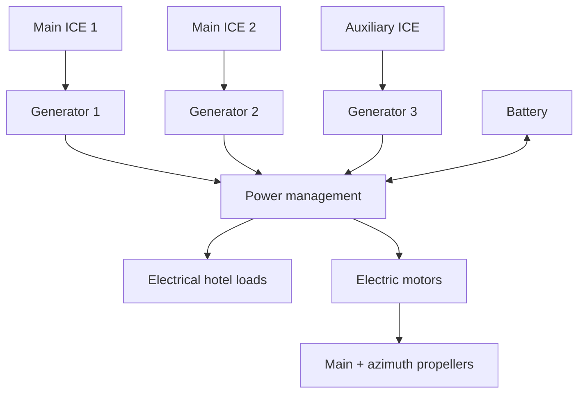

# Hybrid Offshore Vessel Energy & Emissions Analysis

Academic team project completed at the **Aristotle University of Thessaloniki, Department of Mechanical Engineering** (2025) for the course *Greenhouse Gas Reduction Technologies*.

The project evaluated the operation of a **hybrid offshore construction vessel** using **Simcenter Amesim** and MATLAB-based post-processing. The analysis covered power flows, fuel consumption, energy efficiency, CO₂ emissions, the Carbon Intensity Indicator (CII), and several design/control interventions aimed at reducing energy use and emissions.

My work focused on the simulation and main engineering analysis, including MATLAB post-processing. Another team member developed the Python vessel-route visualization in the team report.

## System / Simulation Model



## Methodology

1. Configure and modify the course/software-provided Simcenter Amesim model and run weather and operating scenarios.
2. Export cumulative fuel, cumulative CO₂ and time-resolved power signals.
3. Use MATLAB to sum engine contributions and integrate power over time.
4. Compare weather cases and evaluate control, component-sizing and propulsion-design alternatives against the reference.

## Energy & Emissions Analysis

The fuel and CO₂ scripts sum the final cumulative values from the three engines. The CII calculation uses CO₂ in grams divided by deadweight in tonnes and distance in nautical miles, with project assumptions of 3,050 t deadweight and 280.705 nm distance.

The energy script integrates fuel power plus the signed battery contribution using `trapz`. Output energy comprises electrical load and propeller power. Vessel efficiency is output/input energy; the project's propulsion-efficiency metric is propeller/input energy. Integrating kW over seconds produces kJ, which is divided by 1e6 to obtain GJ. Battery power retains the original export sign convention.

Run the following scripts in MATLAB; data paths are resolved relative to each script's location:

```matlab
run('src/matlab/analyze_fuel_consumption.m')
run('src/matlab/analyze_energy_efficiency.m')
run('src/matlab/analyze_cii.m')
```

The scripts print summaries; the fuel and energy scripts also open plots. `figures/` is reserved for exported figures. The scripts do not overwrite the reported summary CSVs.

## Weather Scenarios

| Weather condition | Fuel [t] | CO₂ [t] | CII [g CO₂/(t·nm)] | Vessel efficiency | Propulsion efficiency |
|---|---:|---:|---:|---:|---:|
| Good | 71.77 | 226.06 | 264.04 | 15.78% | 9.75% |
| Medium | 74.24 | 233.86 | 273.15 | 15.50% | 9.68% |
| Bad | 71.82 | 226.23 | 264.25 | 14.49% | 9.74% |

The medium-weather simulation produced the highest fuel consumption and CII. In the project report, the lower-than-expected bad-weather fuel use was linked to periods in which wind/wave effects reduced the effective resistance acting on the vessel.

## Design Improvements

Several interventions were tested against the reference configuration:

- **Supervisory control:** increasing the maximum electrical power setting of engines 1 and 2 reduced the need to activate the auxiliary engine.
- **ICE sizing:** simulations were performed with 78 L, 74 L, and 70 L engine capacities.
- **Alternative fuel:** an LNG scenario was evaluated with modified fuel properties and vessel mass.
- **Battery control:** initial and maximum SOC were increased to 90%, while minimum SOC was increased to 50%.
- **Propeller redesign:** the propeller diameter was increased from **4.9 m to 5.5 m**.
- **Combined solution:** a **74 L ICE + 5.5 m propeller** configuration was evaluated.

## Key Results

| Metric | Reference | Combined solution | Reported reduction |
|---|---:|---:|---:|
| Fuel consumption | 71.77 t | 66.63 t | ~7% |
| CO₂ emissions | 226.06 t | 209.57 t | ~7% |
| CII | 264.04 | 244.78 | ~7% |
| Energy consumption | 3157.94 GJ | 2661.44 GJ | ~16% |

## Repository Structure

```text
.
├── figures/
├── project_notes.md
├── data/
│   ├── good_weather/
│   ├── medium_weather/
│   └── bad_weather/
├── results/
│   ├── weather_scenarios_summary.csv
│   └── design_scenarios_summary.csv
├── src/
│   └── matlab/
│       ├── analyze_fuel_consumption.m
│       ├── analyze_energy_efficiency.m
│       └── analyze_cii.m
├── .gitignore
└── README.md
```

## Tools

- **Simcenter Amesim** — dynamic system simulation
- **MATLAB** — exported-data processing, integration, calculations, and visualization
- **Excel** — supplementary calculations and result organization during the academic project

## Reproducibility and model availability

The project used a provided Simcenter Amesim base model from the software's marine navigation demo/library environment. The model is **not distributed in this repository**. Amesim-generated binaries, state-machine build files, and large simulation-result packages are also excluded.

The repository contains the MATLAB post-processing workflow and standardized weather-scenario exports. Design-case time-series exports are not included; the design summary retains the reported project results. The complete Amesim simulation cannot be rerun from this repository alone.

## Data notes

The CSVs in `results/` retain the values reported in the final academic report. The MATLAB scripts follow the original methodology, with relative data paths and explicit units for integrated energy (GJ).

### Reported summaries versus supplied exports

Recalculating the supplied exports gives slightly different fuel/CO₂/CII values from the reported summaries:

| Scenario | Export fuel [t] | Export CO₂ [t] | Export CII [g CO₂/(t·nm)] |
|---|---:|---:|---:|
| Good | 71.81 | 226.40 | 264.44 |
| Medium | 74.28 | 234.00 | 273.32 |
| Bad | 71.79 | 225.80 | 263.74 |

The cause of these differences remains unresolved, and both the exports and reported summaries are retained as supplied. Energy-efficiency calculations agree with the weather summary at its displayed precision. The fuel, CO₂ and CII summaries require verification against the final report and original simulation runs.

The combined design case reports approximately 16% lower simulated energy consumption and 7% lower fuel consumption, CO₂ and CII relative to the reference. These are simulation results, not measured vessel performance.

The export calculations were checked using Python; execution of the included MATLAB scripts has not yet been verified.
